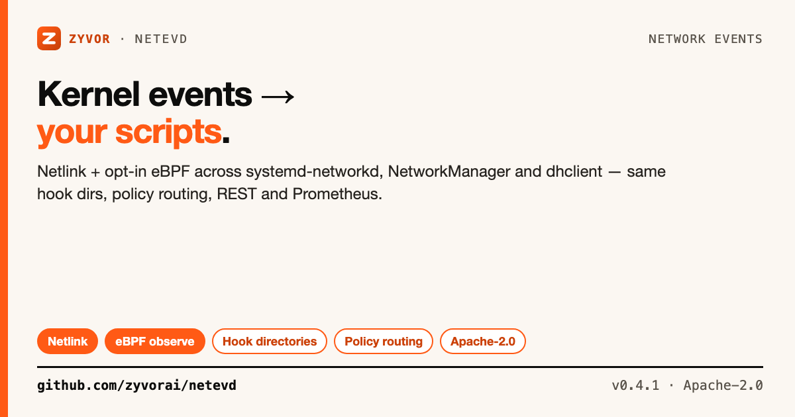
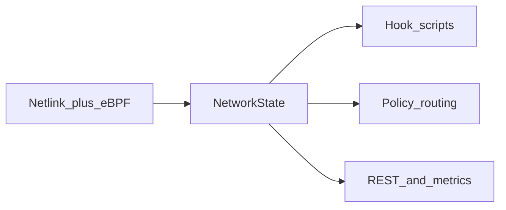

# netevd

[](https://www.apache.org/licenses/LICENSE-2.0)
[](https://github.com/zyvorai/netevd/actions/workflows/ci.yml)
[](https://github.com/zyvorai/netevd/actions/workflows/functional-tests.yml)
[](https://codecov.io/gh/zyvorai/netevd)
[](https://github.com/zyvorai/netevd/releases)
[](https://github.com/zyvorai/netevd/pkgs/container/netevd)



**Kernel events → your scripts.**

netevd turns Linux netlink (and opt-in eBPF) into drop-in hook directories — across systemd-networkd, NetworkManager, and dhclient — with policy routing, REST, and Prometheus.

**[Install](#install)** · **[User guide](docs/user/README.md)** · **[eBPF](docs/user/ebpf.md)** · **[Config example](config/netevd.example.yaml)**

| | |
|---|---|
| Backends | systemd-networkd · NetworkManager · dhclient |
| Hooks | 17 directories (carrier, routable, link/address, eBPF drops…) |
| Latency | &lt;100 ms netlink · zero polling |
| eBPF | Opt-in observe-only: drops / TCP retransmit / TCP reset |
| Ops | Policy routing · REST `:9090` · Prometheus `/metrics` |
| License | Apache-2.0 |

## Why this exists

| You have… | netevd gives you… |
|-----------|-------------------|
| Scripts that should run when the network changes | Drop a file in `/etc/netevd/routable.d/` |
| Multi-homed return-path breakage | Automatic per-interface tables + policy rules |
| NetworkManager `dispatcher.d` only | One contract for networkd, NM, and dhclient |
| Cron polling `ip addr` | Real netlink multicast (&lt;100 ms) |
| Silent `kfree_skb` / TCP RST netlink never sees | Opt-in eBPF → `drops.d` / `tcp-reset.d` |
| Hand-rolled netlink + debounce + safe exec | Already done — with validated `$LINK` / `$JSON` |

## 30-second hook

```bash
sudo tee /etc/netevd/routable.d/01-notify.sh >/dev/null <<'EOF'
#!/bin/bash
logger -t netevd "$LINK is routable: $ADDRESSES"
EOF
sudo chmod +x /etc/netevd/routable.d/01-notify.sh
```

When the interface becomes fully routable, that script runs. Same idea for carrier, link add/remove, routes — and, with eBPF, packet drops and TCP resets.

## Install

### Release tarball (recommended)

```bash
curl -LO https://github.com/zyvorai/netevd/releases/download/v0.4.1/netevd-0.4.1-linux-amd64.tar.gz
tar xzf netevd-*-linux-amd64.tar.gz && cd netevd-*-linux-amd64
sudo ./install.sh && sudo systemctl enable --now netevd
```

### From source

```bash
git clone https://github.com/zyvorai/netevd.git && cd netevd
cargo build --release
# optional: make -C ebpf && cargo build --release --features ebpf
sudo install -Dm755 target/release/netevd /usr/bin/netevd
sudo install -Dm644 systemd/netevd.service /lib/systemd/system/netevd.service
sudo install -Dm644 config/netevd.example.yaml /etc/netevd/netevd.yaml
sudo systemctl enable --now netevd
```

### Container

```bash
docker pull ghcr.io/zyvorai/netevd:latest-ubuntu   # or :latest-alpine
```

Images ship on every `main` push. Hook scripts have `bash` and `ip`; D-Bus uses zbus (no `dbus`/`systemd` in the image).

### Remote lab prove

```bash
./scripts/deploy-remote.sh <host> [user]   # builds, installs, veth + eBPF attach check
```

## Observe-only eBPF

Netlink covers link, address, and route. It does **not** see silent stack drops or TCP retransmit/RST. With `--features ebpf`, the same hook contract gets three more sources — no XDP/TC deny, no DNS/SNI, no process attribution.

| Kernel source | Hook directory |
|---------------|----------------|
| `skb:kfree_skb` | `/etc/netevd/drops.d/` |
| `tcp:tcp_retransmit_skb` | `/etc/netevd/tcp-retransmit.d/` |
| `tcp:tcp_*_reset` | `/etc/netevd/tcp-reset.d/` |

```bash
make -C ebpf
cargo build --release --features ebpf
sudo install -Dm644 ebpf/netevd-ebpf.o /usr/lib/netevd/netevd-ebpf.o
sudo install -Dm644 systemd/netevd-ebpf.conf /etc/systemd/system/netevd.service.d/ebpf.conf
```

```yaml
ebpf:
  enabled: true
  drops: true
  tcp_reset: true
  min_count: 8
  reasons_deny: ["NO_SOCKET"]
```

Scripts get `$DROP_REASON`, `$PROTOCOL`, `$SPORT`/`$DPORT`, `$COUNT`, `$JSON`. Metrics: `netevd_ebpf_*`. Full guide: [docs/user/ebpf.md](docs/user/ebpf.md).

## How it works



1. **Sources** — netlink multicast, backend D-Bus (or dhclient leases), optional eBPF ringbuf  
2. **State** — one `NetworkState` behind `Arc<RwLock>`, updated by Tokio tasks  
3. **Actions** — matching `/etc/netevd/<event>.d/` scripts, policy rules, optional DNS/hostname via D-Bus  

## Hooks (headline dirs)

| Directory | Fires when |
|-----------|------------|
| `carrier.d/` / `no-carrier.d/` | Link up / down |
| `routable.d/` | Full L3 connectivity |
| `link-added.d/` / `link-removed.d/` | Interface appears / disappears |
| `address-added.d/` | Address configured |
| `drops.d/` / `tcp-reset.d/` | eBPF observe-only (opt-in) |

All 17 directories, env vars, and `netevd.event.v1` JSON: [docs/hooks-contract.md](docs/hooks-contract.md). Use `01-` / `02-` prefixes for order; non-zero exits are logged and do not block siblings.

Every script gets `$LINK`, `$LINKINDEX`, `$STATE`, `$BACKEND`, `$ADDRESSES` (plus `$JSON` / DHCP fields by backend).

## Policy routing

List an interface under `routing.policy_rules` and netevd:

1. Creates table `200 + ifindex`  
2. Adds `from <ip>` / `to <ip>` lookup rules  
3. Installs a default via that interface’s gateway  
4. Tears it down when addresses leave  

```bash
$ ip rule list
32765: from 192.168.1.100 lookup 203

$ ip route show table 203
default via 192.168.1.1 dev eth1
```

## Configuration

Minimal shape — full template: [config/netevd.example.yaml](config/netevd.example.yaml).

```yaml
system:
  backend: "systemd-networkd"    # or NetworkManager | dhclient
monitoring:
  match_patterns: ["eth*", "wg*"]
  exclude: ["lo", "docker*", "veth*"]
hooks:
  debounce_ms: 50
routing:
  policy_rules: ["eth1"]
```

## Security

1. Starts as root, drops to user `netevd`  
2. `CAP_NET_ADMIN` by default; eBPF builds also keep `CAP_BPF`, `CAP_PERFMON`, `CAP_DAC_READ_SEARCH`  
3. Validated interface names / IPs / hostnames — no shell metacharacters  
4. Scripts exec’d directly (not `sh -c`)  
5. systemd hardening (`NoNewPrivileges`, `ProtectSystem=strict`, …); eBPF re-allows `bpf` / `perf_event_open`  

Details: [SECURITY.md](SECURITY.md).

## Performance

| Metric | Typical |
|--------|---------|
| RSS idle | 3–5 MB |
| CPU idle | &lt;1 % |
| Netlink event latency | &lt;100 ms |
| Event → script | &lt;10 ms |
| Throughput | 1000+ events/s |

## REST API

Same port as Prometheus (default `9090`):

```bash
curl -s localhost:9090/api/v1/status
curl -s localhost:9090/api/v1/interfaces
curl -s localhost:9090/api/v1/events
curl -s localhost:9090/metrics
curl -s localhost:9090/health
```

## Development

```bash
cargo build && cargo test && cargo clippy -- -D warnings
# eBPF unit tests (no CAP_BPF): cargo test --lib ebpf::
```

## Enterprise

| | Community (this repo) | Enterprise |
|---|----------------------|------------|
| Support | [GitHub Issues](https://github.com/zyvorai/netevd/issues) | SLA · [sales@zyvor.dev](mailto:sales@zyvor.dev) |
| Scope | Self-hosted hooks + policy routing | Production rollouts, platform integration |
| Platform | netevd | netctl, cloud-netconfig, HyperSDK |

[Demo](https://zyvor.dev/demo?utm_source=github&utm_medium=netevd) · [Pricing](https://zyvor.dev/pricing?utm_source=github&utm_medium=netevd) · [Contact](https://zyvor.dev/contact?utm_source=github&utm_medium=netevd) · [docs/enterprise.md](docs/enterprise.md)

## Support

Maintained by **Susant Sahani** · [Zyvor AI Labs](https://zyvor.dev?utm_source=github&utm_medium=netevd). Community help: [Issues](https://github.com/zyvorai/netevd/issues) · [SECURITY.md](SECURITY.md).

## License

**Apache-2.0** — use, modify, and run in production subject to the [LICENSE](LICENSE). Enterprise support and Zyvor products are licensed separately ([sales@zyvor.dev](mailto:sales@zyvor.dev)).
